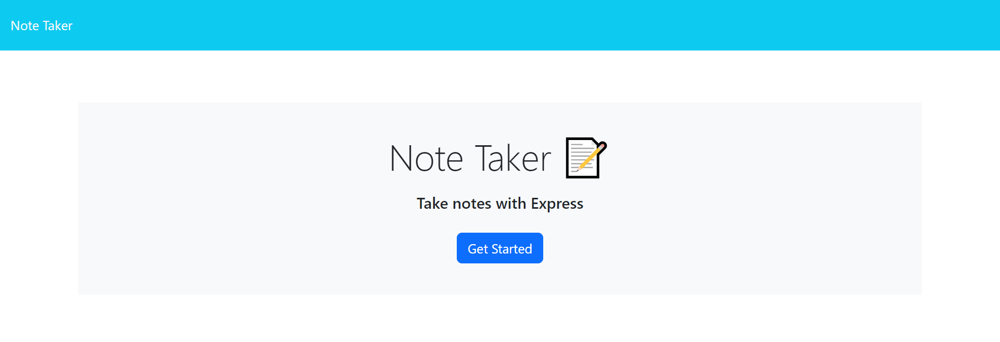
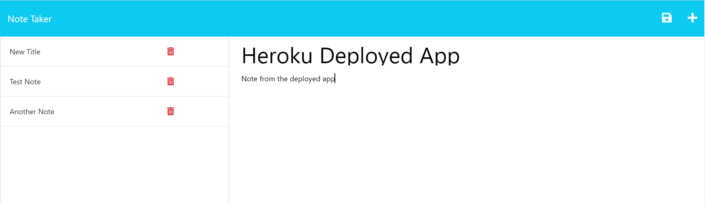

# note-taker-app
Use Express.js to build the back end of a note taking app and deploy to Heroku.

## User Story
AS A small business owner  
I WANT to be able to write and save notes  
SO THAT I can organize my thoughts and keep track of tasks I need to complete

## Acceptance Criteria
GIVEN a note-taking application  
WHEN I open the Note Taker  
THEN I am presented with a landing page with a link to a notes page  
WHEN I click on the link to the notes page  
THEN I am presented with a page with existing notes listed in the left-hand column, plus empty fields to enter a new note title and the note’s text in the right-hand column  
WHEN I enter a new note title and the note’s text  
THEN a Save icon appears in the navigation at the top of the page  
WHEN I click on the Save icon  
THEN the new note I have entered is saved and appears in the left-hand column with the other existing notes  
WHEN I click on an existing note in the list in the left-hand column  
THEN that note appears in the right-hand column  
WHEN I click on the Write icon in the navigation at the top of the page  
THEN I am presented with empty fields to enter a new note title and the note’s text in the right-hand column

## Description of Work Performed
* Imported Express package to create back end functionality for provided front end files
* Wrote back end functions and middleware to allow communication between client and server
* Notes can be added/saved and deleted from the app and the interface updates dynamically
* Application has been deployed to Heroku

## Link to deployed Heroku page
[Deployed Challenge 11 Note Taker App](https://fierce-fjord-08413.herokuapp.com/)

## Screenshots

## License
This project is licensed under the MIT License - see the LICENSE.md file for details.

# Resources
- Node packages: 
  - [Express](https://www.npmjs.com/package/express)
  - [UUID](https://www.npmjs.com/package/uuid)